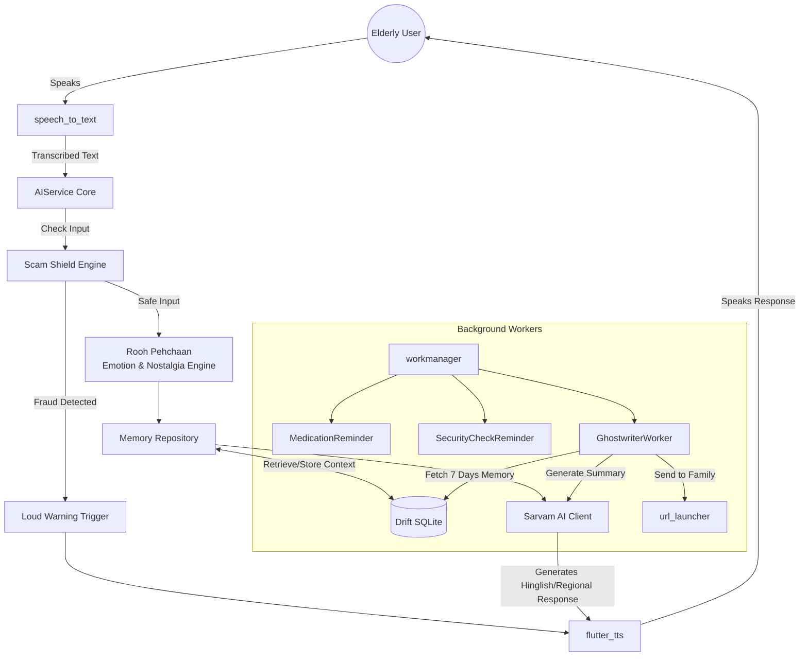

<div align="center">

# 🌸 Sneh Saathi
### A Voice Companion for Elderly Care

*"Technology should not replace humans — it should bring them closer."*


</div>

---

## 📖 About

**Sneh Saathi** is a warm, voice-first AI companion designed for elderly Indian users—especially those living alone.  
It focuses on **emotional well-being, safety, medication adherence, and family connection**.

Built from the ground up based on real elderly care pain points in India, Sneh Saathi is an **offline-first, emotionally intelligent companion** with highly accessible UI/UX.

---

## ✨ The 3 Laws of Sneh Saathi UX

| # | Law |
|---|-----|
| 1 | **One Screen, One Job** |
| 2 | **Every Error Must Self-Resolve** |
| 3 | **The App Must Never Feel Like Technology** |

---

## 🚀 Key Features

### 📱 Interface & Accessibility

- **Ultra-Simple Radial Home Screen**  
  Scroll-free layout with core actions (Talk, Meds, Family, Security, Saavdhan), optimized for quick access and low cognitive load.

- **Voice-First Onboarding**  
  No email, no password, no typing. A 3-step guided voice setup captures name, family contacts, and medication routine.

- **Accessible Aesthetics**  
  Warm high-contrast palette, large typography, and clear visual hierarchy tuned for aging eyes (Material 3).

### 🌟 Signature Features

- **⚡ Call-Like Voice Experience**  
  Streaming TTS starts speaking the first sentence while the rest of the response is still being generated, making interactions feel natural and alive.

- **🌏 Regional Dialect Engine (Sarvam AI)**  
  Supports Marathi, Gujarati, Punjabi, Bihari, and Haryanvi conversational flavor with contextual fillers (*Bhau, Kasa kay, Kem cho, Puttar, Babu*) for familiarity and comfort.

- **📝 Parivaar Bridge (Weekly Ghostwriter)**  
  Private on-device memory summarization, then optional weekly family-ready WhatsApp updates generated automatically.

- **💛 Rooh Pehchaan — Emotional & Nostalgia Engine**  
  Tracks emotional tone over time. If sadness/anxiety markers appear, assistant response style shifts to gentler pacing, comfort-first language, and nostalgia prompts.

- **🛡️ Saavdhan (Scam Alert & Shield)**  
  Dedicated scam-check mode for suspicious calls/messages with hybrid offline+online analysis and clear **Green / Amber / Red** confidence signaling.

- **💊 Dawai Saathi**  
  Proactive medication assistant that understands real-world replies like *“baad mein”* or *“thodi der mein”* and performs smart follow-up reminders.

---

## 🔄 App Workflow



---

## 🧩 Architecture & Tech Stack

Sneh Saathi follows **Clean Architecture + Riverpod**, optimized for reliability, modularity, and offline resilience.

### 📱 Frontend

| Technology | Usage |
|---|---|
| Flutter & Dart | Cross-platform UI (Android/iOS) |
| Riverpod | State management + dependency injection |
| Flutter Plugins | Audio, permissions, notifications, device integrations |

### ⚙️ Core Systems (Offline-First)

| Technology | Usage |
|---|---|
| Drift (SQLite) | Local persistence: memories, conversations, medications |
| WorkManager | Reliable background tasks, survives reboots |
| SharedPreferences | Lightweight user settings (voice speed, contacts, dialect prefs) |

### 🤖 AI & NLP

| Technology | Usage |
|---|---|
| Sarvam AI | Hinglish + regional dialect LLM |
| flutter_tts | On-device speech output with rate/pitch tuning |
| Saavdhan Engine | Hybrid rule-based + AI-assisted fraud detection |

### 🟢 Google Technologies

| Technology | Usage |
|---|---|
| Firebase Firestore | Cloud backup for memories and summaries |
| Firebase Storage | Cloud media/audio storage |
| TensorFlow Lite (LiteRT) | On-device embeddings/classification (prepared) |

---

## 📁 Folder Structure

```text
lib/
├── core/                  # Network observers, TTS, clients, global helpers
├── data/
│   ├── local/             # Drift DB, DAOs, entities, SharedPreferences
│   └── repository/        # Repositories + RAG implementation
├── features/
│   ├── chat/              # Chat interface
│   ├── family/            # Ghostwriter worker + Family Hub
│   ├── home/              # Radial Home Screen
│   ├── medication/        # Medication reminder worker
│   ├── scam_alert/        # Scam detection UI
│   ├── scamshield/        # Scam detection logic
│   └── security/          # Security check worker
└── main.dart              # App entry point
```

---

## ⚙️ Background Workers

| Worker | Trigger | Action |
|---|---|---|
| 💊 `MedicationReminderWorker` | Daily schedule | Voice reminder + Hindi/English response understanding |
| 🔒 `SecurityReminderWorker` | Evening schedule | Door/gas/safety checklist prompt |
| 📬 `GhostwriterWorker` | Every 7 days | Read memories → generate summary → send to family |

---

## 🎥 Demo & Links

- 🔗 **GitHub Repository:** [https://github.com/Purjeet979/SnehaSathi](https://github.com/Purjeet979/SnehaSathi)
- 🎥 **Demo Video (3 min):** [https://drive.google.com/file/d/1ex35QU-pGOgB0uwNVdA2_kaKEmGRx_He/view?usp=sharing](https://drive.google.com/file/d/1ex35QU-pGOgB0uwNVdA2_kaKEmGRx_He/view?usp=sharing)

---

## 👥 Team

**Developer:** Purjeet  
**Submission:** Hackathon Project

---

<div align="center">
🌸 <em>Built with care for those who shaped us.</em>
</div>
