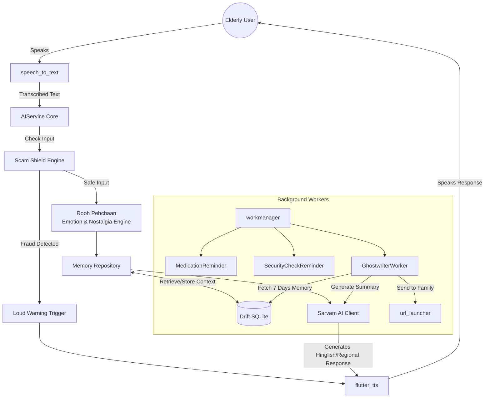

<div align="center">

# 🌸 Sneh Saathi
### A Voice Companion for Elderly Care

*"Technology should not replace humans — it should bring them closer."*


</div>

---

## 📖 About

**Sneh Saathi** is a warm, voice-first AI companion designed for elderly Indian users — especially those living alone. It focuses on **emotional well-being, safety, medication reminders, and family connection** using simple voice interactions and regional dialects, instead of complex touch interfaces.

Built from the ground up based on a deep analysis of Indian elderly pain points, Sneh Saathi is an **offline-first, emotionally intelligent companion** with a highly accessible UI/UX.

---

## ✨ The 3 Laws of Sneh Saathi UX

| # | Law |
|---|-----|
| 1 | **One Screen, One Job** |
| 2 | **Every Error Must Self-Resolve** |
| 3 | **The App Must Never Feel Like Technology** |

---

## 🚀 Key Features

### 📱 Interface & Accessibility

- **Ultra-Simple Radial Home Screen** — Scroll-free layout with core actions (Talk, Meds, Family, Security, Saavdhan) anchored by an accessible interface
- **Voice-First Onboarding** — No emails, no passwords, no typing. A 3-step voice conversation sets up name, family contacts, and medications
- **Accessible Aesthetics** — High-contrast warm cream palette with large typography optimized for aging eyes (Material 3)

### 🌟 Unique "Wow Factor" Features

- **⚡ Zero-Latency Voice Mode** — AI responses hook directly into native on-device TTS via `flutter_tts`. Replies instantly — just like a real phone call

- **🌏 Regional Dialect Engine (Sarvam AI)** — Speaks Marathi, Gujarati, Punjabi, Bihari, and Haryanvi. Dynamically injects regional filler words (*Bhau, Kasa kay, Kem cho, Puttar, Babu*) so the elderly feel truly at home

- **📝 Parivaar Bridge (Weekly Ghostwriter)** — **Zero-Cost WhatsApp Automation!** A fully automated GitHub Actions workflow runs every Sunday, fetches 7 days of Dadi's conversations, uses **Sarvam AI** to generate a heartwarming Hinglish summary, and automatically sends it to family members via the **WhatsApp Cloud API**. Completely serverless, hands-free, and runs on free tiers!

- **💛 Rooh Pehchaan — Emotional & Nostalgia Engine** — Detects emotions (Sad, Anxious, Happy) and nostalgia triggers. If Dadi mentions "the old days", the AI pivots to ask deeper questions about her youth — keeping her memories alive

- **🛡️ Saavdhan (Scam Alert & Shield)** — A dedicated safe space where users can paste SMS or use voice to check if a message/call is a scam. Uses hybrid offline/online checks with clear Green/Amber/Red visual alerts, plus a live Scam Awareness Feed to keep the elderly informed about ongoing frauds.

- **💊 Smart Health & Security Affirmations** — Proactively asks "Have you taken your blood pressure pill?" and understands responses in both English (*yeah, nope*) and Hindi (*haan, baad mein*)

---

## 🔄 App Workflow



---

## 🧩 Architecture & Tech Stack

Sneh Saathi uses **Clean Architecture** with **Riverpod** optimized for cross-platform offline resilience.

### 📱 Frontend
| Technology | Usage |
|---|---|
| Flutter & Dart | Declarative UI for Android/iOS |
| Riverpod | State Management & Dependency Injection |
| Flutter Plugins | Localized Audio, Call/SMS permissions |

### ⚙️ Core Systems (Offline-First)
| Technology | Usage |
|---|---|
| Drift Database | Local persistence — Memories, Conversations, Medications |
| WorkManager | Guaranteed background execution, survives device reboots |
| SharedPreferences | Voice Speed, Contacts, Dialect preferences |

### 🤖 AI & NLP
| Technology | Usage |
|---|---|
| Sarvam AI | Hinglish + regional dialect LLM |
| flutter_tts | On-device speech with pitch, rate & emotion tuning |
| Saavdhan (Scam Shield) | Hybrid Rule-based + AI fraud detection with Green/Amber/Red confidence system |

### 🟢 Google Technologies
| Technology | Usage |
|---|---|
| Firebase Firestore | Cloud backup for memories & family summaries |
| Firebase Storage | Cloud-synced media and audio |
| TensorFlow Lite (LiteRT) | On-device embeddings & text classification (prepared) |

---

## 📁 Folder Structure

```
lib/
├── core/                  # Network observers, TTS, clients, global helpers
├── data/
│   ├── local/             # Drift DB, DAOs, Entities, SharedPreferences
│   └── repository/        # RAG implementation, Repositories
├── features/
│   ├── chat/              # Chat interface
│   ├── family/            # GhostwriterWorker & Family Hub
│   ├── home/              # Main Radial Home Screen
│   ├── medication/        # Medication Reminder Worker
│   ├── scam_alert/        # Scam Detection UI
│   ├── scamshield/        # Scam Detector Logic
│   └── security/          # Security Check Worker
└── main.dart              # Entry point
```

---

## ⚙️ Background Workers

| Worker | Trigger | Action |
|---|---|---|
| 💊 `MedicationReminderWorker` | Scheduled daily | Voice reminder to take medicines; understands Hindi & English confirmations |
| 🔒 `SecurityReminderWorker` | Evening schedule | Asks about door locks, gas, and safety checks |
| 📬 `GhostwriterWorker` | Every 7 days | Reads memories → writes family summary → sends via WhatsApp |

---

## 🎥 Demo & Links

- 🔗 **GitHub:** [github.com/Purjeet979/HackWins](https://github.com/Purjeet979/HackWins)
- 🎥 **Demo Video (3 min):** [Google Drive](https://drive.google.com/drive/folders/17j_PTlFP8RmSxmHQ0Uu3O9PmVIW0VLa6?usp=sharing)

---

## 👥 Team

**Developer:** Purjeet &nbsp;|&nbsp; **Submission:** Hackathon Project

---

<div align="center">
🌸 &nbsp;<em>Built with care for those who shaped us</em>
</div>
