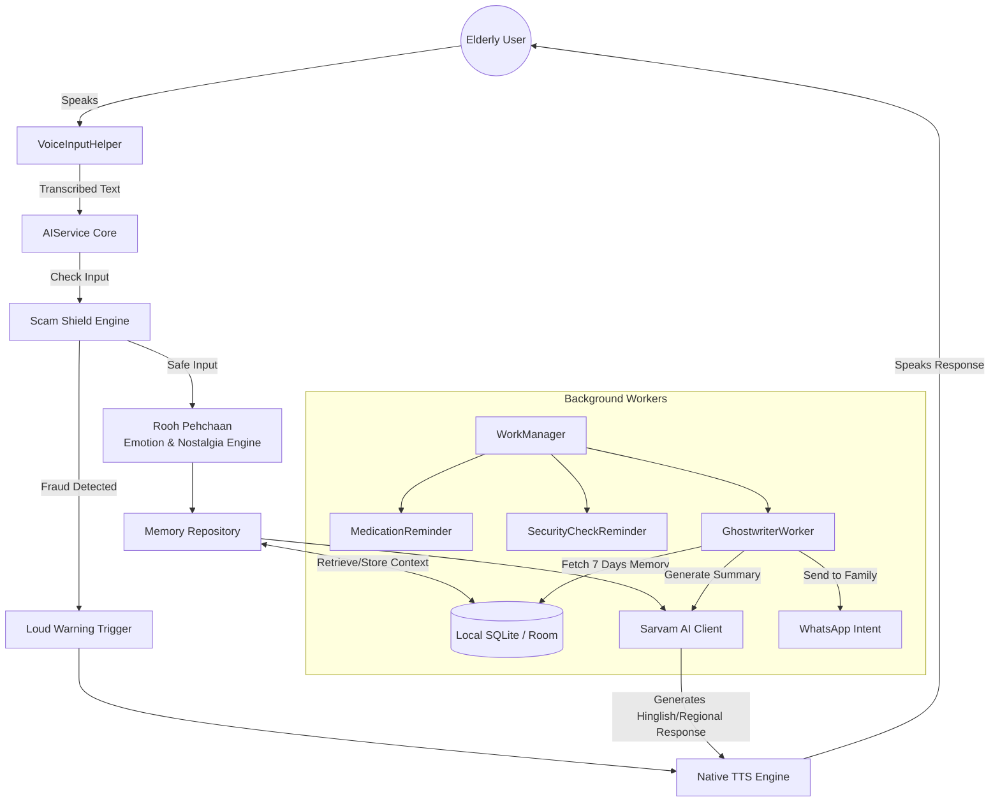

<div align="center">

# 🌸 Sneh Saathi
### A Voice Companion for Elderly Care

*"Technology should not replace humans — it should bring them closer."*


</div>

---

## 📖 About

**Sneh Saathi** is a warm, voice-first AI companion designed for elderly Indian users — especially those living alone. It focuses on **emotional well-being, safety, medication reminders, and family connection** using simple voice interactions and regional dialects, instead of complex touch interfaces.

Built from the ground up based on a deep analysis of Indian elderly pain points, Sneh Saathi is an **offline-first, emotionally intelligent companion** with a highly accessible UI/UX.

---

## ✨ The 3 Laws of Sneh Saathi UX

| # | Law |
|---|-----|
| 1 | **One Screen, One Job** |
| 2 | **Every Error Must Self-Resolve** |
| 3 | **The App Must Never Feel Like Technology** |

---

## 🚀 Key Features

### 📱 Interface & Accessibility

- **Ultra-Simple Radial Home Screen** — Scroll-free layout with 5 core actions (Talk, Meds, Family, Security, Neighborhood) anchored by a massive SOS button
- **Voice-First Onboarding** — No emails, no passwords, no typing. A 3-step voice conversation sets up name, family contacts, and medications
- **Accessible Aesthetics** — High-contrast warm cream palette with large typography optimized for aging eyes (Material 3)

### 🌟 Unique "Wow Factor" Features

- **⚡ Zero-Latency Voice Mode** — AI responses hook directly into native on-device Android TTS. Replies instantly — just like a real phone call

- **🌏 Regional Dialect Engine (Sarvam AI)** — Speaks Marathi, Gujarati, Punjabi, Bihari, and Haryanvi. Dynamically injects regional filler words (*Bhau, Kasa kay, Kem cho, Puttar, Babu*) so the elderly feel truly at home

- **📝 Weekly Ghostwriter — Parivaar Bridge** — A background worker secretly reads 7 days of Dadi's conversations and uses AI to ghostwrite a highly emotional, human-like family summary — then prepares a 1-tap WhatsApp message

- **💛 Rooh Pehchaan — Emotional & Nostalgia Engine** — Detects emotions (Sad, Anxious, Happy) and nostalgia triggers. If Dadi mentions "the old days", the AI pivots to ask deeper questions about her youth — keeping her memories alive

- **🛡️ Scam Shield Engine** — Scans inputs for keywords like *OTP, Bank, Police, Lottery*. If fraud is detected, overrides the AI with a loud, immediate warning in her native language

- **💊 Smart Health & Security Affirmations** — Proactively asks "Have you taken your blood pressure pill?" and understands responses in both English (*yeah, nope*) and Hindi (*haan, baad mein*)

---

## 🔄 App Workflow



---

## 🧩 Architecture & Tech Stack

Sneh Saathi uses **Clean Architecture** (Data → Domain → Presentation) optimized for offline resilience and privacy.

### 📱 Frontend
| Technology | Usage |
|---|---|
| Kotlin & Jetpack Compose | Declarative UI with Material 3 |
| Accompanist Permissions | Localized Audio, Camera, Call/SMS permissions |
| Hilt | Dependency Injection |

### ⚙️ Core Systems (Offline-First)
| Technology | Usage |
|---|---|
| Room Database | Local persistence — Memories, Conversations, Medications, Health Logs |
| WorkManager | Guaranteed background execution, survives device reboots |
| DataStore | Voice Speed, Contacts, Dialect preferences |

### 🤖 AI & NLP
| Technology | Usage |
|---|---|
| Sarvam AI | Hinglish + regional dialect LLM |
| Native TTS Manager | On-device speech with pitch, rate & emotion tuning |
| Scam Shield | Rule-based + AI fraud detection with override system |

### 🟢 Google Technologies
| Technology | Usage |
|---|---|
| Firebase Firestore | Cloud backup for memories & family summaries |
| Firebase Background Services | Cloud-synced family connectivity |
| TensorFlow Lite (LiteRT) | On-device embeddings & text classification (prepared) |

---

## 📁 Folder Structure

```
app/src/main/java/com/example/snehsaathi/
├── core/                  # Network observers, TTS, clients, global helpers
├── data/
│   ├── local/             # Room DB, DAOs, Entities, DataStore
│   └── repository/        # RAG implementation, TFLite Embeddings
├── features/
│   ├── family/            # GhostwriterWorker & Family Hub
│   ├── medication/        # Medication Reminder Worker
│   ├── neighborhood/      # Padosi Sang & Geolocation
│   ├── scamshield/        # Scam Detector & Warning Dialog
│   └── sos/               # SOS Compose Buttons
└── ui/
    ├── main/              # MainActivity — Radial Home Screen
    └── theme/             # High-contrast Colors, Typography, Theme
```

---

## ⚙️ Background Workers

| Worker | Trigger | Action |
|---|---|---|
| 💊 `MedicationReminderWorker` | Scheduled daily | Voice reminder to take medicines; understands Hindi & English confirmations |
| 🔒 `SecurityReminderWorker` | Evening schedule | Asks about door locks, gas, and safety checks |
| 📬 `GhostwriterWorker` | Every 7 days | Reads memories → writes family summary → sends via WhatsApp |

---

## 🎥 Demo & Links

- 🔗 **GitHub:** [github.com/Purjeet979/HackWins](https://github.com/Purjeet979/HackWins)
- 🎥 **Demo Video (3 min):** [Google Drive](https://drive.google.com/drive/folders/17j_PTlFP8RmSxmHQ0Uu3O9PmVIW0VLa6?usp=sharing)

---

## 👥 Team

**Developer:** Purjeet &nbsp;|&nbsp; **Submission:** Hackathon Project

---

<div align="center">
🌸 &nbsp;<em>Built with care for those who shaped us</em>
</div>
