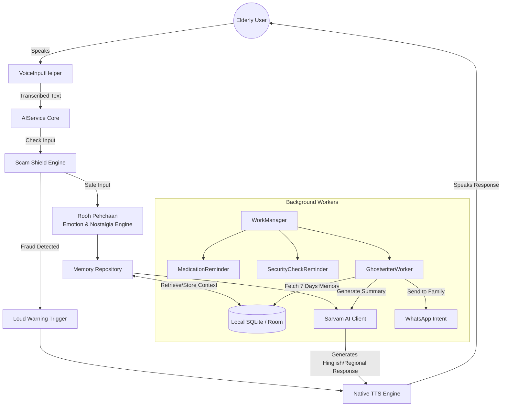

# 🌸 Sneh Saathi — A Voice Companion for Elderly Care

**Sneh Saathi** is a warm, voice-first AI companion designed for elderly Indian users, especially those living alone.  
It focuses on **emotional well-being, safety, memory, and family connection**, using simple voice interactions and regional dialects instead of complex interfaces.

> *"Technology should not replace humans — it should bring them closer."*  

---

## 🚀 Key Features & Hackathon Unique Selling Points (USPs)

Sneh Saathi is designed from the ground up based on a deep analysis of Indian elderly pain points. It is an **offline-first, emotionally intelligent companion** with a highly accessible UI/UX.

### ✨ The UI/UX Paradigm Shift
- **The 3 Laws of Sneh Saathi UX:** 
  1. *One Screen, One Job* 
  2. *Every Error Must Self-Resolve* 
  3. *The App Must Never Feel Like Technology*
- **Ultra-Simple Radial Home Screen:** We discarded complex tab bars for a hyper-legible, scroll-free button layout (Talk, Meds, Family, Security, Neighborhood) anchored by a massive SOS button.
- **Voice-First Onboarding:** No emails, no passwords, no typing. The app asks for the user's name, family members, and medications entirely through a 3-step voice conversation.
- **Accessible Aesthetics:** Implemented a high-contrast, warm cream palette with large typography and UI elements optimized for aging eyes.

### 🌟 Unique Hackathon Features (The "Wow" Factor)
- **Zero-Latency Voice Mode:** We eliminated API audio latency by hooking our AI responses directly into native on-device Android Text-to-Speech (TTS). The companion replies instantly, just like a real phone call.
- **Regional Dialect Engine (Sarvam AI):** Sneh Saathi doesn't just speak Hindi. It can be toggled into **Marathi, Gujarati, Punjabi, Bihari, or Haryanvi** accents. The AI dynamically injects regional filler words (e.g., *Bhau, Kasa kay, Kem cho, Puttar, Babu*) to make the elderly feel truly at home.
- **Weekly "Ghostwriter" (Parivaar Bridge):** A background worker (`GhostwriterWorker`) wakes up weekly, secretly reads the last 7 days of Dadi's conversations/memories, and uses AI to "ghostwrite" a highly emotional, non-robotic summary. It then prepares a 1-tap WhatsApp notification to instantly share this update with her family.
- **Rooh Pehchaan (Emotional & Nostalgia Engine):** Analyzes the text for emotions (Sad, Anxious, Happy) and *Nostalgia*. If Dadi talks about the "old days", the AI automatically pivots to ask deeper questions about her youth, acting as an active listener and keeping her memories alive.
- **Smart Voice Affirmations for Health & Security:** The app proactively asks "Have you taken your blood pressure pill?" or "Did you lock the door?". It intelligently understands affirmative/negative responses in English (*yeah, yep, nope*) and Hindi (*haan, le li, baad mein*).

---

## 🧩 Architecture & Technology Stack

### 🔄 App Workflow Diagram


Sneh Saathi uses a robust, modern **Clean Architecture** (Data, Domain, Presentation) optimized for offline resilience and privacy.

### 📁 Folder Structure
```text
app/src/main/java/com/example/snehsaathi/
├── core/                  # Network observers, TTS, clients, and global helpers
├── data/
│   ├── local/             # Room DB, DAOs, Entities, DataStore
│   └── repository/        # RAG implementation, TFLite Embeddings
├── features/              # Feature-packaged vertical slices
│   ├── family/            # GhostwriterWorker & Family Hub
│   ├── medication/        # Medication Reminder Worker
│   ├── neighborhood/      # Padosi Sang & Geolocation 
│   ├── scamshield/        # Scam Detector & Warning Dialog
│   └── sos/               # SOS Compose Buttons
├── ui/
    ├── main/              # MainActivity (4-Button Radial Home Screen)
    └── theme/             # High-contrast Colors, Typography, and Theme
```

### 📱 Frontend (Android)
- **Kotlin & Jetpack Compose:** Fully declarative UI using modern Material 3 guidelines adapted for extreme accessibility.
- **Accompanist Permissions:** Seamless, localized permission requests for Audio, Camera, and Call/SMS (for the SOS feature).
- **Hilt (Dependency Injection):** For clean, decoupled module management.

### ⚙️ Core Systems (Offline-First)
- **Room Database:** Local persistence layer caching `Memories`, `Conversations`, `Medications`, and `HealthLogs`.
- **WorkManager:** Guaranteed background execution for `MedicationReminderWorker`, `SecurityReminderWorker`, and `GhostwriterWorker`—even after device reboots.
- **DataStore:** Type-safe, reactive storage of Dadi's preferences (Voice Speed, Contacts, Dialect).

### 🤖 AI & NLP
- **Sarvam AI (Cloud):** Highly-tuned LLM specialized in authentic Indian Hinglish context and regional dialects.
- **Native TTS Manager:** Android's native Text-to-Speech initialized with optimized pitch, speech rates, and emotional tone adjustments.
- **Scam Shield (Rule-based + AI):** Scans Dadi's inputs for keywords like "OTP", "Bank", "Police", "Lottery". If detected, it overrides the AI and throws a loud, immediate warning in her native language advising her to hang up.

---

## 🟢 Google Technology Usage (Mandatory Requirement)
- **Firebase Firestore:** Backup layer for memories and family daily summaries.
- **Firebase Background Services.**
- **TensorFlow Lite (LiteRT):** (Prepared for on-device embedding generation and text classification).

---

## 🎥 Demo & Links

- **GitHub Repository:**  
  https://github.com/Purjeet979/HackWins

- **Demo Video (3 minutes):**  
  [Google Drive Link](https://drive.google.com/drive/folders/17j_PTlFP8RmSxmHQ0Uu3O9PmVIW0VLa6?usp=sharing)

---

## 👥 Team

- **Developer:** Purjeet  
- **Project:** Hackathon Submission
